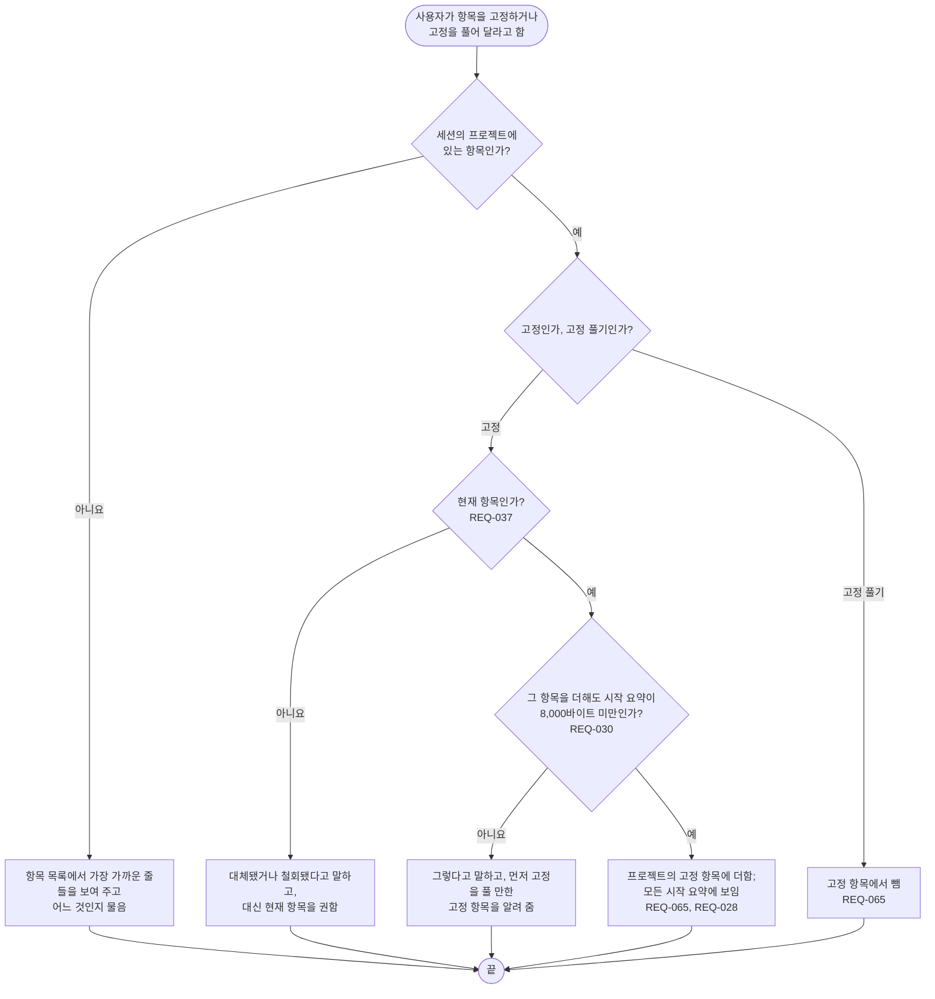

# FL-008 항목 고정하기와 고정 풀기

[English](FL-008-pin-an-item.md)

다루는 요구사항: REQ-028, REQ-030, REQ-037, REQ-065

맥락: CTX-005 관리. 사용자가 프로젝트의 모든 시작 요약에 보이도록 항목을 고정해 달라고 하거나, 고정을 풀어 달라고 할 때 시작합니다.

```mermaid
flowchart TD
  A(["사용자가 항목을 고정하거나<br/>고정을 풀어 달라고 함"]) --> B{"세션의 프로젝트에<br/>있는 항목인가?"}
  B -->|아니요| B1["항목 목록에서 가장 가까운 줄들을 보여 주고<br/>어느 것인지 물음"]
  B1 --> Z(["끝"])
  B -->|예| C{"고정인가, 고정 풀기인가?"}
  C -->|고정| D{"현재 항목인가?<br/>REQ-037"}
  D -->|아니요| D1["대체됐거나 철회됐다고 말하고,<br/>대신 현재 항목을 권함"]
  D1 --> Z
  D -->|예| E{"그 항목을 더해도 시작 요약이<br/>8,000바이트 미만인가?<br/>REQ-030"}
  E -->|아니요| E1["그렇다고 말하고, 먼저 고정을 풀 만한<br/>고정 항목을 알려 줌"]
  E1 --> Z
  E -->|예| F["프로젝트의 고정 항목에 더함;<br/>모든 시작 요약에 보임<br/>REQ-065, REQ-028"]
  F --> Z
  C -->|고정 풀기| G["고정 항목에서 뺌<br/>REQ-065"]
  G --> Z
```
