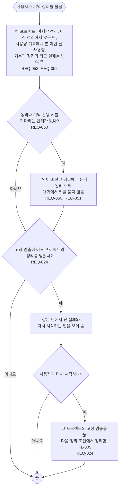

# FL-010 기억 상태 보기

[English](FL-010-check-the-status.md)

다루는 요구사항: REQ-024, REQ-050, REQ-051, REQ-052, REQ-053

맥락: CTX-005 관리. 사용자가 기억 상태를 물을 때 시작합니다. 고장 멈춤이 멈춘 정리를 사용자가 다시 시작하는 곳이기도 합니다.

```mermaid
flowchart TD
  A(["사용자가 기억 상태를 물음"]) --> B["켠 프로젝트, 마지막 정리, 아직 정리하지 않은 턴,<br/>사용량 기록에서 본 이번 달 사용량,<br/>기록과 정리의 최근 실패를 보여 줌<br/>REQ-053, REQ-052"]
  B --> C{"동의나 기억 전용 키를<br/>기다리는 단계가 있나?<br/>REQ-050"}
  C -->|예| C1["무엇이 빠졌고 어디에 두는지 알려 주되<br/>대화에서 키를 묻지 않음<br/>REQ-050, REQ-051"]
  C -->|아니요| D{"고장 멈춤이 어느 프로젝트의<br/>정리를 멈췄나?<br/>REQ-024"}
  C1 --> D
  D -->|아니요| Z(["끝"])
  D -->|예| E["같은 턴에서 난 실패와<br/>다시 시작하는 법을 보여 줌"]
  E --> F{"사용자가 다시 시작하나?"}
  F -->|아니요| Z
  F -->|예| G["그 프로젝트의 고장 멈춤을 풂;<br/>다음 정리 조건에서 정리함, FL-005<br/>REQ-024"]
  G --> Z
```
