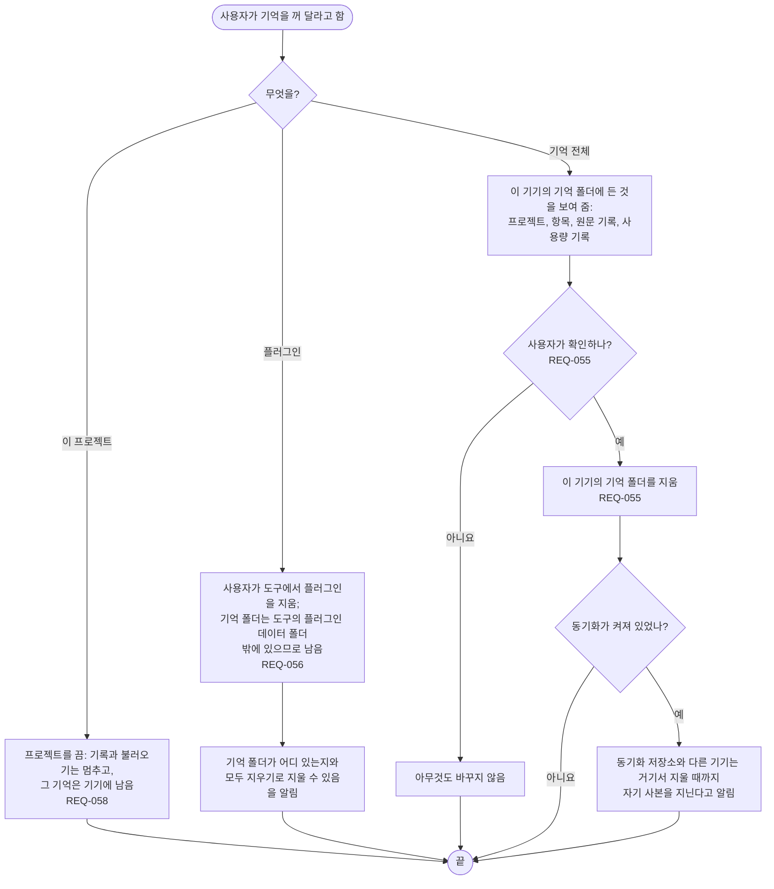

# FL-011 기억 끄기

[English](FL-011-turn-memory-off.md)

다루는 요구사항: REQ-055, REQ-056, REQ-058

맥락: CTX-005 관리. 사용자가 한 프로젝트의 기억을 끄거나, 플러그인을 지우거나, 기기의 기억을 모두 지워 달라고 할 때 시작합니다.

```mermaid
flowchart TD
  A(["사용자가 기억을 꺼 달라고 함"]) --> B{"무엇을?"}
  B -->|이 프로젝트| C["프로젝트를 끔: 기록과 불러오기는 멈추고,<br/>그 기억은 기기에 남음<br/>REQ-058"]
  C --> Z(["끝"])
  B -->|플러그인| D["사용자가 도구에서 플러그인을 지움;<br/>기억 폴더는 도구의 플러그인 데이터 폴더<br/>밖에 있으므로 남음<br/>REQ-056"]
  D --> D1["기억 폴더가 어디 있는지와<br/>모두 지우기로 지울 수 있음을 알림"]
  D1 --> Z
  B -->|기억 전체| E["이 기기의 기억 폴더에 든 것을 보여 줌:<br/>프로젝트, 항목, 원문 기록, 사용량 기록"]
  E --> F{"사용자가 확인하나?<br/>REQ-055"}
  F -->|아니요| F1["아무것도 바꾸지 않음"]
  F1 --> Z
  F -->|예| G["이 기기의 기억 폴더를 지움<br/>REQ-055"]
  G --> H{"동기화가 켜져 있었나?"}
  H -->|아니요| Z
  H -->|예| I["동기화 저장소와 다른 기기는 거기서 지울 때까지<br/>자기 사본을 지닌다고 알림"]
  I --> Z
```
